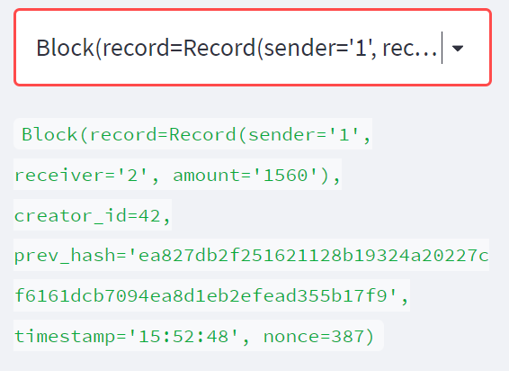
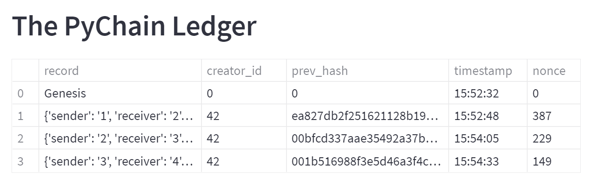
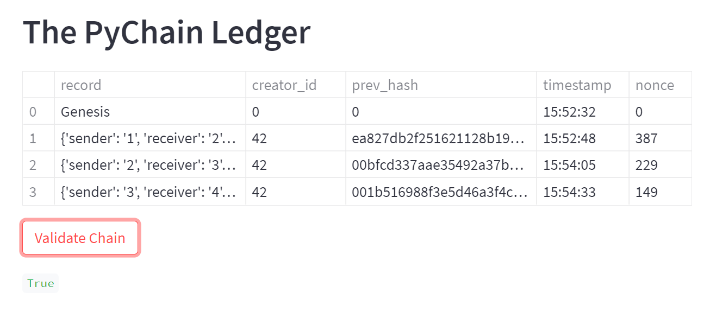

# CFB Mod18 Challenge: Blockchain-based Ledger

This exercise creates a blockchain-based ledger system with a user-friendly web interface designed through Streamlit.  

---

## Technologies

The application is written in Python 3.7 with support from the following packages:  

*[Pandas] (https://github.com/pandas) - Data Analysis

*[DataClasses] (https://github.com/dataclasses) - DataClasses 

*[HashLib] (https://github.com/hashlib) - Hashing

*[Streamlit] (https://github.com/streamlit) - Web Interface

## Installation Guide

Install streamlit through the command **pip install streamlit**

## Usage and Content

To see the analysis, pls clone the repository and run **pychain.py**.  

Here are some images from the Streamlit web interface for the ledger and validation.

Inspector:

Example of Blocks: 

Blockchain Validity:

## Contributors
Vishnu Kurella, vishnu.kurella@gmail.com

## License
VK.LQA 2021
